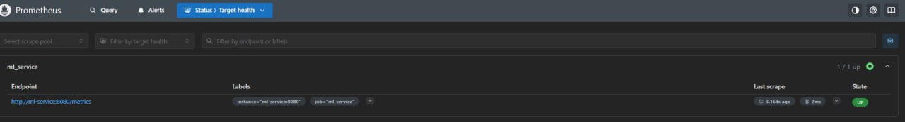

# ML Service Monitoring (MLOps HW #4)

Домашнее задание по настройке мониторинга и алертинга для ML-сервиса с использованием Prometheus и Grafana.

## SLO
- **Latency (p95)** < 1 second

## Стек технологий

- **ML-сервис**: FastAPI + `prometheus_client`
- **Мониторинг**: Prometheus
- **Визуализация и алертинг**: Grafana
- **Оркестрация**: Docker Compose

## Установка
1. Создайте виртуальное окружение и установите зависимости ```pip install -r requirements.txt```
2. Запустите: `docker-compose -f docker-compose.app.yml up --build -d`
3. Откройте:
   - ML Service: http://localhost:8080/api/openapi
   - Prometheus: http://localhost:9090/targets



   - Grafana: http://localhost:3000 (логин/пароль: admin/admin)

## Метрики
- Эндпоинт: `http://localhost:8080/metrics`
- Используемая метрика: request_latency_seconds (тип Histogram)

Пример регистрации метрики в коде: <br>


## Dashboard Grafana


## Алерт
- Срабатывает при p95 latency > 1 сек в течение 2 минут
- Правило алерта настроено в prometheus.yml через Alertmanager: <br>


Окно алерта


## Проверка
Добавьте `time.sleep(2)` в `/predict`, отправьте запросы — алерт активируется. <br>

В окне алерта вы увидете следующее: <br>


Граф алерта: <br>


